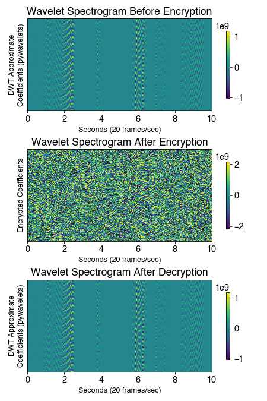

# A Modern Real-Time Audio Encryption System Featuring Chaos Maps and Wavelet Transforms

[](https://ieeexplore.ieee.org/document/10535012)
[](https://www.python.org/)
[](https://opensource.org/licenses/MIT)

This repository contains the source code for the paper **"A Modern Real-Time Audio Encryption System Featuring Chaos Maps and Wavelet Transforms"**, presented at the 2023 IEEE MIT Undergraduate Research Technology Conference (URTC).

> ### Abstract
> Modern technologies rely on the secure transfer of valuable information to protect against data breaches and cyberattacks. The proposed audio processing framework employs Diffie-Hellman key exchanges to seed a Hyper-Chaotic Modified Robust Logistic Map (HC-MRLM) to generate encryption keys. This system successfully and securely transmits audio within a real-time latency threshold of 200 milliseconds. The computational simplicity of our algorithm makes it compatible with older processors and pushes for a greater ubiquity of security across devices.

---

## 🔑 Key Features

* **Real-Time Performance:** The system processes, encrypts, transmits, and decrypts audio signals with an average latency of just **79.009 ms**, well below the 200 ms soft real-time threshold.
* **Chaos-Based Cryptography:** It leverages a Hyper-Chaotic Modified Robust Logistic Map (HC-MRLM) to generate cryptographically secure and pseudorandom encryption keys, making it highly resistant to attacks.
* **Secure Key Exchange:** A **Diffie-Hellman key exchange** is simulated to establish common secrets between two users, which are then used to seed the chaos map, ensuring that decryption keys cannot be derived from encryption keys.
* **Wavelet Transform:** The Discrete Wavelet Transform (DWT) is used to convert audio signals to the frequency domain before encryption, providing a framework for high-quality audio reconstruction and future enhancements like compression or denoising.
* **Lossless Reconstruction:** The cryptographic process is fully reversible, resulting in a **perfect reconstruction** of the original audio signal after decryption, with a Mean Squared Error (MSE) of 0.0.

---

## ⚙️ System Architecture & Program Flow

The system simulates a secure audio transmission between two users (User 1, the sender, and User 2, the receiver). The process is managed by a series of Python scripts that handle distinct parts of the workflow.


### Code Structure

* `main.py`: The main entry point for running the simulation. It allows you to set up the shared secrets, run the User 1 (sender) client, or run the User 2 (receiver) client.
* `diffie_hellman.py`: Implements the Diffie-Hellman key exchange algorithm to securely establish three common secrets between the users.
* `chaos_keys.py`: Implements the Hyper-Chaotic Modified Robust Logistic Map (HC-MRLM). It takes the secrets from the key exchange to seed the chaos map and generate the final XOR encryption keys.
* `audio_record.py`: The client for User 1. It captures audio from a file or microphone, applies the DWT, encrypts the data using the chaos keys, and transmits it over a local socket.
* `audio_play.py`: The client for User 2. It listens on the socket for incoming data, decrypts it using the same chaos keys, applies the Inverse DWT to reconstruct the audio signal, and saves the output to a `.wav` file.
* `generate_graphs.py`: A utility script to analyze the output data and reproduce the spectrogram and latency plots from the research paper.
* `audio_merge.py`: A helper script used to merge the test audio files from the TSP Lab Speech Database into a single file for repeatable testing.

---

## 📊 Results

The system was evaluated on two key metrics: signal latency and encryption effectiveness. The results demonstrate a highly efficient and secure real-time system.

### Spectrogram Analysis

The spectrograms show that the original audio (A) and the decrypted audio (C) are identical, indicating perfect, lossless reconstruction. The encrypted audio (B) is completely unrecognizable, demonstrating the effectiveness of the encryption algorithm.



*Spectrograms of the audio signal before encryption, after encryption, and after decryption, confirming perfect signal recovery.*

### Signal Latency

The system's average end-to-end latency was measured at **79.009 ms**, with a standard deviation of only 0.832 ms. This is well within the 200 ms soft real-time threshold. The processing delay (excluding simulated network latency) was exceptionally low, averaging just **4.009 ms**.


*Latency measurements for 600 data points, showing consistent real-time performance.*

---

## 🚀 How to Run

### Dependencies

Ensure you have Python 3 and the following libraries installed:

```bash
pip install numpy sounddevice scipy pywavelets matplotlib
```

### Running the Simulation

The simulation is run from the `main.py` script and follows a three-step process.

**Step 1: Generate Shared Secrets**

First, you must run the Diffie-Hellman key exchange simulation to generate the common secrets. This will create a `key_exchange` directory with the necessary files.

```bash
python main.py
# When prompted, enter: 0
```

**Step 2: Start the Receiver (User 2)**

In a separate terminal, start the receiver client. It will wait for a connection from the sender.

```bash
python main.py
# When prompted, enter: 2
```

**Step 3: Start the Sender (User 1)**

In your original terminal, start the sender client. It will connect to the receiver, and the audio transmission and encryption will begin.

```bash
python main.py
# When prompted, enter: 1
```

The decrypted audio will be saved as `output.wav` upon completion.

---

## 📜 Citation

If you use this work, please cite the original paper:

```bibtex
@INPROCEEDINGS{10535012,
  author={Debnath, Eshaan and Pawar, Riya and Merkov, Evan and Bhatia, Rohan and Venkatesan, Kavya and Dasgupta, Sabar},
  booktitle={2023 IEEE MIT Undergraduate Research Technology Conference (URTC)}, 
  title={A Modern Real-Time Audio Encryption System Featuring Chaos Maps and Wavelet Transforms}, 
  year={2023},
  pages={1-5},
  doi={10.1109/URTC60662.2023.10535012}
}
```


